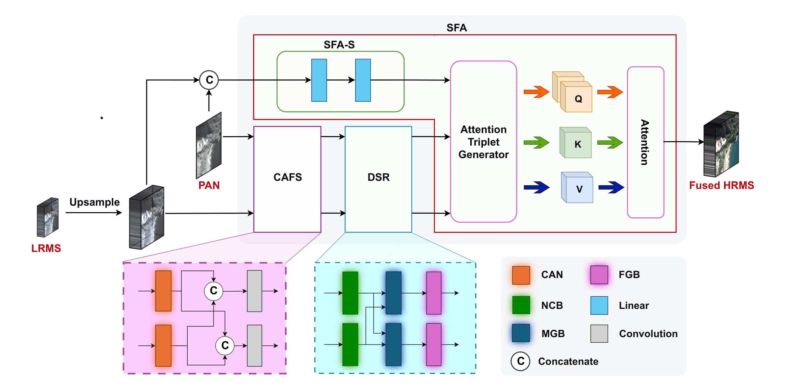
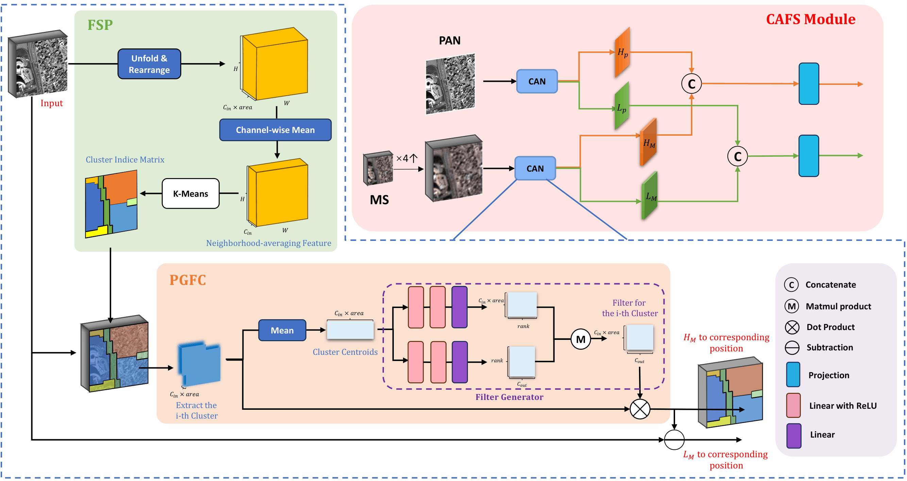
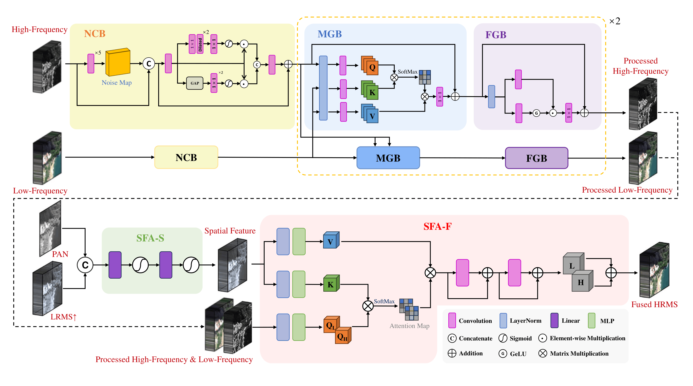

# CGFformer: Cluster-Guidance Frequency Transformer for Pansharpening

<div style="text-align: center;">
  <a href="https://github.com/PatrickNod/CGFformer">
    
  </a>
</div> 

<p style="text-align: justify; font-family: 'Times New Roman';">
  <b>Abstract:</b> Pansharpening aims to generate high-resolution multispectral (HRMS) images by fusing low-resolution multispectral (LRMS) images with high-resolution panchromatic (PAN) images. However, the current mainstream frequency-based pansharpening methods employ fixed frequency filters, which cannot precisely adapt to complex and spatially diversified frequency distributions in PAN and MS images. Furthermore, existing denoising strategies insufficiently exploit frequency components for denoising and struggle to suppress various noise types accurately. To address these challenges, we propose CGFformer, a cluster-guidance frequency Transformer that focuses on varying frequency distribution and interactions between frequency and spatial components. Specifically, we design an adaptive separation module that integrates local features and non-local information through K-means clustering, enabling more precise separation of high- and low-frequency components. Subsequently, we introduce a dual-stream refinement module combined with Transformer-based cross-attention to remove various noise, allowing the network to jointly suppress frequency-relevant and irrelevant disturbances. In addition, we develop a frequency-spatial fusion module designed to enhance detail and facilitate spatial-frequency interaction, ensuring more effective reconstruction of spatial structures in the fused results. Extensive experiments on multiple benchmark datasets demonstrate that the proposed CGFformer achieves notable improvements over existing pansharpening approaches.
</p>

### News:

- 2026/04/03: **Code RELEASED!** :fire: 
- 2025/12/13: **Repository Created!** :rocket:

---

## Quick Review

Below are the visualizations of our proposed network architecture:

<center>



</center>

---

## Instructions

### Code Structure

- `model.py`: This file contains the complete implementation of the CGFformer network architecture. It includes the Cluster Adaptive Frequency Separation (`CAFS`) module utilizing K-means clustering for dynamic frequency extraction, the Dual-Stream Refinement (`DSR` via `MGB_FGB_Stage`) module with Transformer-based mutual guidance, and the Spatial-Frequency Attention (`SFA`) module for feature integration. It also features the highly optimized `LinearMLP` and `Attention` blocks to ensure efficiency.
- `trainer_distributed.py`: The main training script designed for multi-GPU environments using `torch.nn.DataParallel`. It includes the complete training pipeline, H5 dataset loading, pure L1 loss computation, an exponential learning rate decay strategy, and automatic checkpoint saving based on validation loss.
- `visualization_cluster.py`: A dedicated visualization tool. It uses PyTorch forward hooks to extract the internal clustering index matrices from the `CAFS`  module during inference. It processes H5 test datasets and saves the clustering maps as heatmaps, allowing users to visually inspect how the network adaptively partitions spatial features across different epochs.

### Dataset

The experiments in this paper utilize the WorldView-3 (WV3) and GaoFen-2 (GF-2) datasets. Since we use the open-source datasets provided by the community, please download them from the following repository:

🔗 **[liangjiandeng/PanCollection: Pansharpening Dataset](https://github.com/liangjiandeng/PanCollection)**

```bibtex
@ARTICLE{dengjig2022,
    author={邓良剑，冉燃，吴潇，张添敬},
    journal={中国图象图形学报},
    title={遥感图像全色锐化的卷积神经网络方法研究进展},
    year={2022},
    volume={},
    number={9},
    pages={},
    doi={10.11834/jig.220540}
}

@ARTICLE{deng2022vivone,
    author={L. -J. Deng, G. Vivone, M. E. Paoletti, G. Scarpa, J. He, Y. Zhang, J. Chanussot, and A. Plaza},
    journal={IEEE Geoscience and Remote Sensing Magazine}, 
    title={Machine Learning in Pansharpening: A Benchmark, from Shallow to Deep Networks}, 
    year={2022},
    volume={10},
    number={3},
    pages={279-315},
    doi={10.1109/MGRS.2022.3187652}
}
```

---

## Convenient Access to Results and Support for Beginners

The creator of this repository is also the first author of this paper. This article is not only the author's first academic paper in the field of pansharpening but also their first paper on the path of artificial intelligence. Therefore, it contains the author's heart, soul, and hard work. It is deeply hoped that this dedication will lead to a smooth submission process and ensure the author's future academic career is successful.

In addition, if researchers in the field of pansharpening wish to use this article as a baseline for comparison, you are welcome to contact the author directly to obtain the pre-trained weight files and gain a deeper understanding of this work. 

📫 **Email:** zzj210119@stu.xjtu.edu.cn

Of course, the author would be highly honored to communicate and exchange ideas with fellow scholars and researchers in the field of pansharpening.

---

*The weight files and evaluation metrics of the network architecture will be provided soon.*
